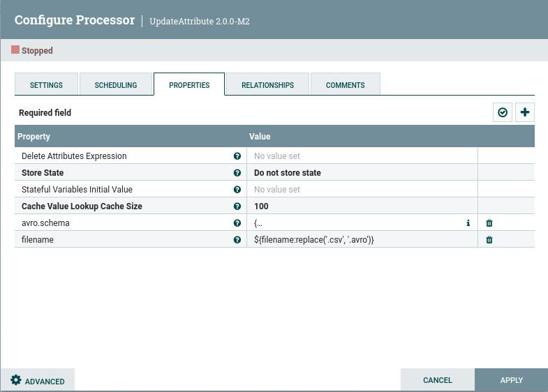
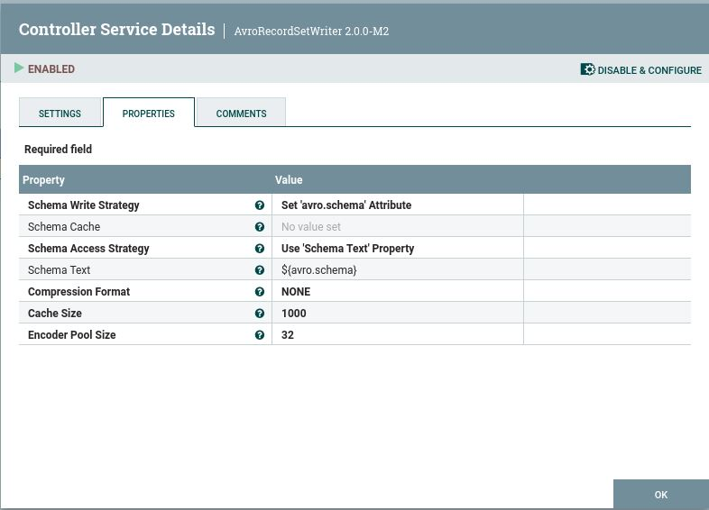

# Parte de NIFI en Ejercicio2

## Enunciado
Queremos serializar un CSV con Avro y enviarlo a un topic de Kafka, todo ello con NIFI

## Pasos

### 1. Importar el CSV -> GetFile

- Indicamos la carpeta dónde se encuentra el CSV

### 2. Añadir extensión .avro -> UpdateAttribute

- Añadimos property "Filename" para cambiar el nombre: fichero.csv -> fichero.avro
  
- Añadimos property "schema.name" para incluir el esquema AVRO que se encuentra en el codigo

### 3. Enviar a un topic de Kafka -> PublishKafkaRecord

- Debemos añadir controller services en Record reader (CSVReader1) y Record Writer (AvroRecordSetWriter), y los activamos:

  
