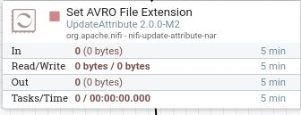
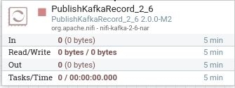

# Parte de NIFI en Ejercicio2

## Enunciado
Queremos serializar un CSV con Avro y enviarlo a un topic de Kafka, todo ello con NIFI

### Pasos

1. Importar el CSV -> GetFile

2. Añadir extensión .avro -> UpdateAttribute

3. Enviar a un topic de Kafka -> PublishKafkaRecord

