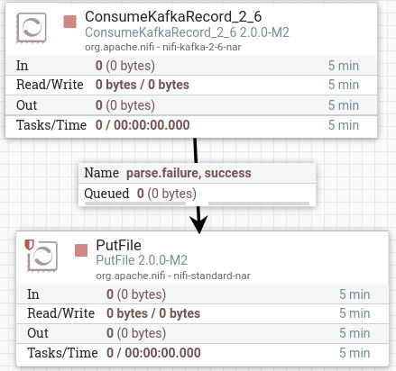
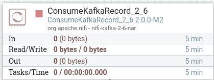
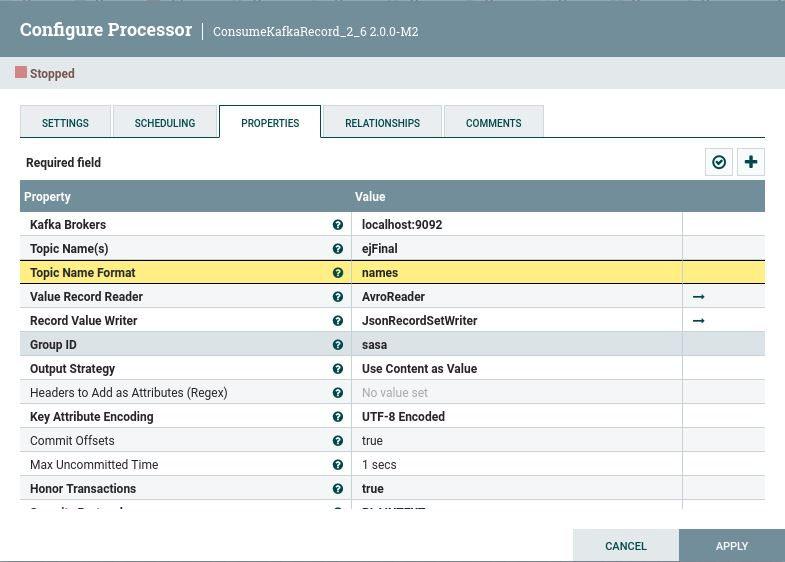
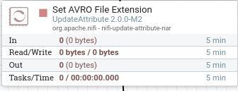
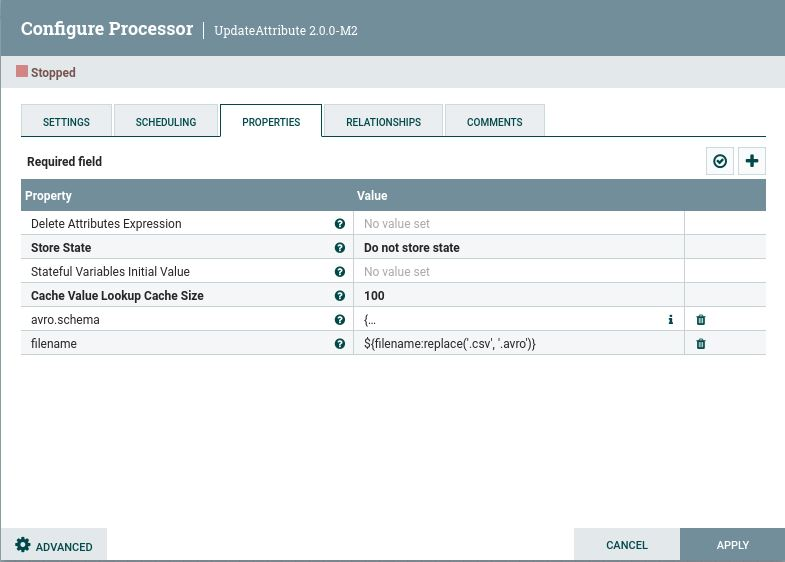
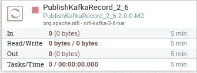
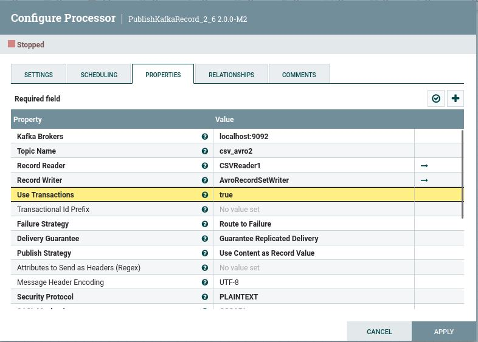
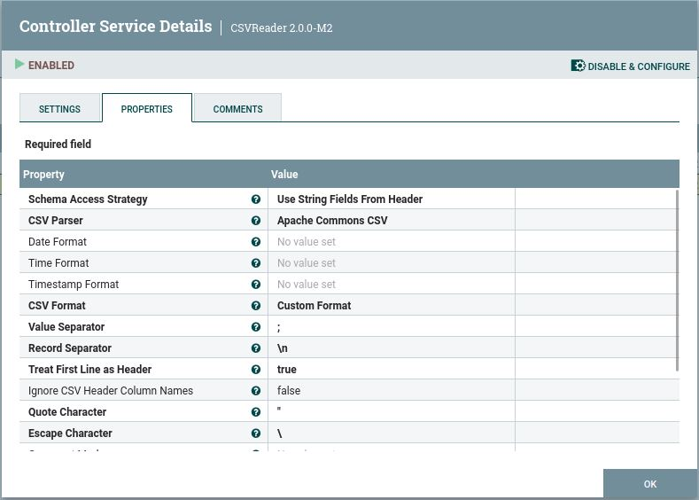
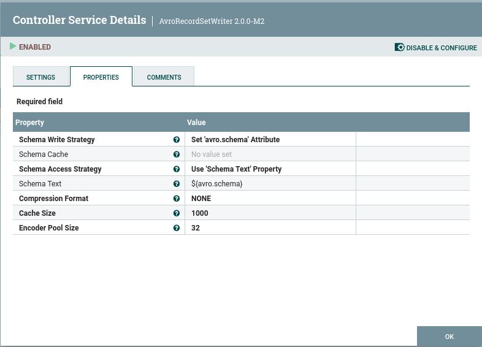

# Parte de NIFI en Ejercicio3

## Enunciado
Queremos leer un topic de Kafka, deserializarlo de Avro y convertirlo a JSON, todo ello con NIFI

## Pasos

### 1. COnsumir un topic de Kafka y transformarlo a JSON

- Indicar el topic al que enviaremos los datos, además de la localización de los brokers

- Debemos añadir controller services en Record reader (AvroReader) y Record Writer (AvroRecordSetWriter), y los activamos:

- Indicamos la carpeta dónde se encuentra el CSV

### 2. Añadir extensión .avro -> UpdateAttribute

- Añadimos property "Filename" para cambiar el nombre: fichero.csv -> fichero.avro
  
- Añadimos property "schema.name" para incluir el esquema AVRO que se encuentra en el codigo

### 3. Enviar a un topic de Kafka -> PublishKafkaRecord

- Indicar el topic al que enviaremos los datos, además de la locaclización de los brokers

- Debemos añadir controller services en Record reader (CSVReader1) y Record Writer (AvroRecordSetWriter), y los activamos:

- Indicar el uso de "header" y el ";" como separador

- Usar el shcema.name especificado anteriormente

  
