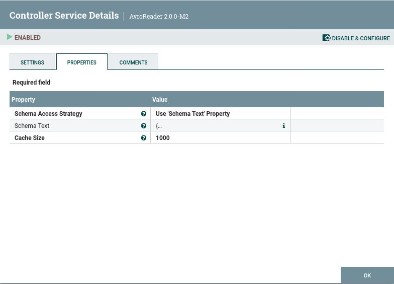
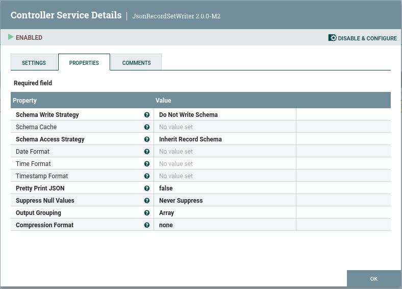
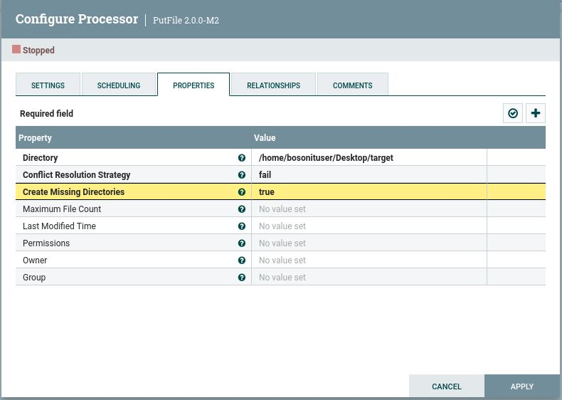

# Parte de NIFI en Ejercicio3

## Enunciado
Queremos leer un topic de Kafka, deserializarlo de Avro y convertirlo a JSON, todo ello con NIFI

## Pasos

### 1. Consumir un topic de Kafka y transformarlo a JSON

- Indicar el topic al que enviaremos los datos, además de la localización de los brokers

- Debemos añadir controller services en Record reader (AvroReader) y Record Writer (jsonRecordSetWriter), y los activamos:

- Usamos el schema.name y el esquema que encontramos en el código

### 2. Colocamos el JSON en un directorio -> PutFile

  
